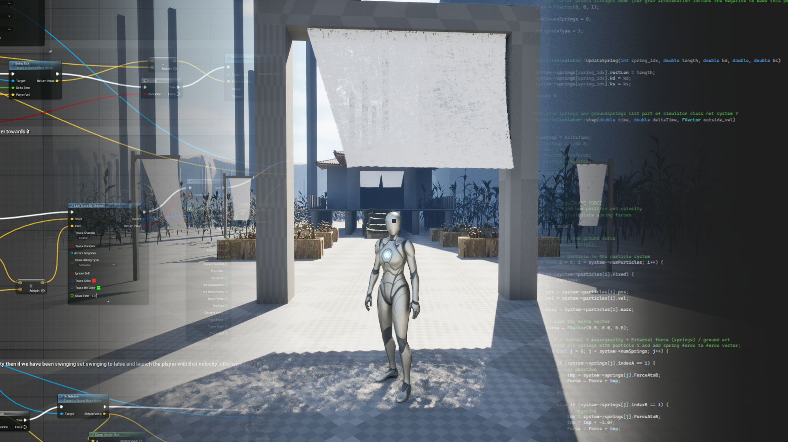

Source and Blueprints of Unreal demo project

# Spring Mass Unreal Demo Project 

This project integrates a custom spring mass physics system into Unreal Engine 5 and uses it to implement cloth simulation and grappling hook game mechanics. 

